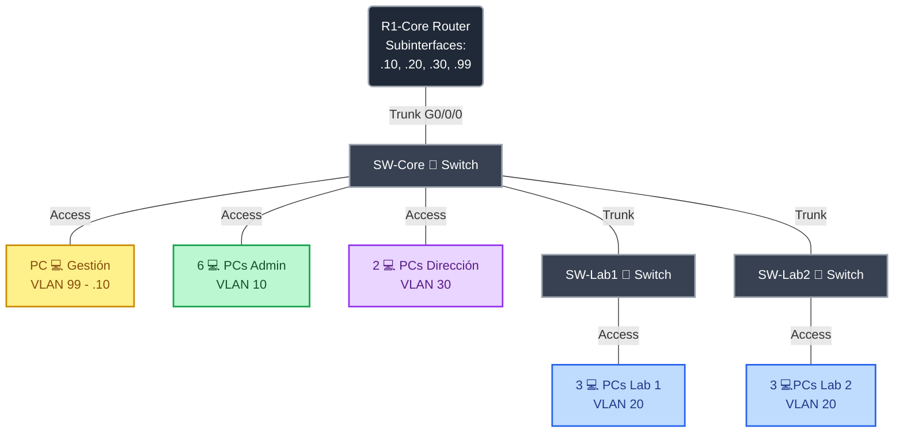
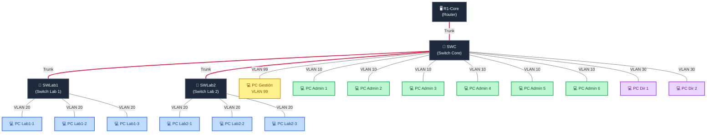
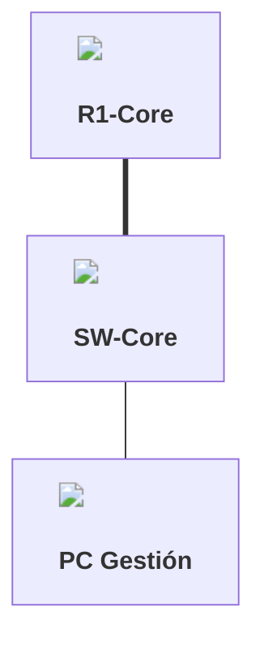

# 🌐 Mi Portafolio de Redes: Proyecto Campus Conalep039
**Estudiante:** Enrique Lzro  
**Matrícula/Código:** [Tu Código de Alumno]  
**Grupo:** [Tu Grupo]  
**Enlace a mi sitio web público:** [Pega aquí el enlace de tu GitHub Pages]

---

## 🏢 Presentación del Caso
Este portafolio digital documenta paso a paso la construcción de la red para el *Campus Conalep039*. A lo largo de tres unidades, se registrarán las configuraciones técnicas, códigos CLI y la solución de problemas (troubleshooting) con base en el temario oficial de Cisco CCNA 2 (SRWE v7).

---

## 📍 Etapa 1: Infraestructura Base y Segmentación (Módulos 1-4)



<!--



-->
### 🗺️ 1. Topología Física Oficial de la Red
*Conecta los dispositivos en Cisco Packet Tracer siguiendo estrictamente este esquema de estrella extendida:*

```text
               [ R1-Core (Router) ]
                        |
                        | (Interfaz G0/0/0)
                        |
                 [ SW-Core ] ------------- Dispositivos Locales:
                  /       \                ├── VLAN 99: 1 PC Gestión
                 /         \               ├── VLAN 10: 6 PCs Administrativos
                /           \              └── VLAN 30: 2 PCs Dirección
               /             \
          [ SW-Lab1 ]    [ SW-Lab2 ]

              |                |
       (VLAN 20: 3 PCs) (VLAN 20: 3 PCs)
```

### 🛠️ 2. Archivo de Simulación
*   **Enlace de descarga:** [Descarga aquí mi archivo de Packet Tracer (.pkt)](📌 REEMPLAZAR_ESTE_TEXTO_CON_EL_ENLACE_A_TU_ARCHIVO_PKT)
*   *Nota: Recuerda que el archivo .pkt debe estar subido en este mismo repositorio de GitHub.*

### 📋 3. Tabla de Direccionamiento IP y Equipos
*Completa los datos de la red asignada de acuerdo a las configuraciones de tus subinterfaces en el Router y las SVIs de los switches:*

**Instrucciones:** Con base en las máscaras de subred y los segmentos asignados, calcula y completa las celdas vacías utilizando las reglas y las IPs aleatorias asignadas para cada host.

#### Tabla A: Dispositivos Intermedios (Routers y Switches)

| Dispositivo / Interfaz | VLAN | Segmento de Red Base | Dirección IP a Calcular / Configurar | Máscara de Subred | Gateway por Defecto |
| :--- | :---: | :--- | :--- | :--- | :--- |
| **R1-Core** (`G0/0/0.10`) | 10 | `192.168.10.0/24` | **Última IP utilizable del segmento** | `255.255.255.0` | *No aplica* |
| **R1-Core** (`G0/0/0.20`) | 20 | `192.168.20.0/24` | **Última IP utilizable del segmento** | `255.255.255.0` | *No aplica* |
| **R1-Core** (`G0/0/0.30`) | 30 | `192.168.30.0/24` | **Última IP utilizable del segmento** | `255.255.255.0` | *No aplica* |
| **R1-Core** (`G0/0/0.99`) | 99 | `192.168.99.0/24` | **Última IP utilizable del segmento** | `255.255.255.0` | *No aplica* |
| **SW-Core** (SVI `VLAN 99`) | 99 | `192.168.99.0/24` | **1ª IP utilizable del segmento** | `255.255.255.0` | **Última IP utilizable** |
| **SW-Lab1** (SVI `VLAN 99`) | 99 | `192.168.99.0/24` | **2ª IP utilizable del segmento** | `255.255.255.0` | **Última IP utilizable** |
| **SW-Lab2** (SVI `VLAN 99`) | 99 | `192.168.99.0/24` | **3ª IP utilizable del segmento** | `255.255.255.0` | **Última IP utilizable** |

#### Tabla B: Dispositivos Finales (PCs de Usuario y Gestión)

| Dispositivo Final | Puerto del Switch | VLAN | Dirección IP (Formato CIDR) | Gateway por Defecto |
| :--- | :--- | :---: | :--- | :--- |
| **PC-Administrativos-1** | `SW-Core` -> `Fa0/1` | 10 | `192.168.10.15/24` | Última IP utilizable del segmento |
| **PC-Administrativos-2** | `SW-Core` -> `Fa0/2` | 10 | `192.168.10.42/24` | Última IP utilizable del segmento |
| **PC-Administrativos-3** | `SW-Core` -> `Fa0/3` | 10 | `192.168.10.77/24` | Última IP utilizable del segmento |
| **PC-Administrativos-4** | `SW-Core` -> `Fa0/4` | 10 | `192.168.10.101/24` | Última IP utilizable del segmento |
| **PC-Administrativos-5** | `SW-Core` -> `Fa0/5` | 10 | `192.168.10.130/24` | Última IP utilizable del segmento |
| **PC-Administrativos-6** | `SW-Core` -> `Fa0/6` | 10 | `192.168.10.185/24` | Última IP utilizable del segmento |
| **PC-Dirección-1**       | `SW-Core` -> `Fa0/7` | 30 | `192.168.30.22/24` | Última IP utilizable del segmento |
| **PC-Dirección-2**       | `SW-Core` -> `Fa0/8` | 30 | `192.168.30.88/24` | Última IP utilizable del segmento |
| **PC-Gestión** (Única)    | `SW-Core` -> `Fa0/9` | 99 | `192.168.99.50/24` | Última IP utilizable del segmento |
| **PC-Alumnos-Lab1-A**    | `SW-Lab1` -> `Fa0/1` | 20 | `192.168.20.33/24` | Última IP utilizable del segmento |
| **PC-Alumnos-Lab1-B**    | `SW-Lab1` -> `Fa0/2` | 20 | `192.168.20.65/24` | Última IP utilizable del segmento |
| **PC-Alumnos-Lab1-C**    | `SW-Lab1` -> `Fa0/3` | 20 | `192.168.20.120/24` | Última IP utilizable del segmento |
| **PC-Alumnos-Lab2-A**    | `SW-Lab2` -> `Fa0/1` | 20 | `192.168.20.142/24` | Última IP utilizable del segmento |
| **PC-Alumnos-Lab2-B**    | `SW-Lab2` -> `Fa0/2` | 20 | `192.168.20.199/24` | Última IP utilizable del segmento |
| **PC-Alumnos-Lab2-C**    | `SW-Lab2` -> `Fa0/3` | 20 | `192.168.20.210/24` | Última IP utilizable del segmento |


### 📸 4. Evidencias de Verificación (CLI con Firma de Identidad)
> **Instrucciones obligatorias Anti-IA:** Pega aquí abajo las capturas de pantalla de tu CLI de Packet Tracer. Recuerda que el nombre del dispositivo debe incluir tus iniciales (ej. `SW-Core-EL`) y debes ejecutar el comando `show version` en la misma ventana de la consola para validar el tiempo de simulación activo.

### 📋 Evidencia 1: Matriz de Direccionamiento Calculada

**Instrucciones para el estudiante:** Con base en las explicaciones de clase, las máscaras y los prefijos CIDR asignados, calcula las direcciones IP y Gateways correspondientes. Modifica este archivo `README.md` y reemplaza los corchetes `[ ]` con tus resultados numéricos finales.

#### Tabla A: Dispositivos Intermedios (Routers y Switches)

| Dispositivo / Interfaz | VLAN | Segmento de Red Base | Dirección IP a Configurar | Máscara de Subred | Gateway por Defecto |
| :--- | :---: | :--- | :--- | :--- | :--- |
| **R1-Core** (`G0/0/0.10`) | 10 | `192.168.10.0/24` | `[ Calcular IP ]` | `[ Calcular Máscara ]` | *No aplica* |
| **R1-Core** (`G0/0/0.20`) | 20 | `192.168.20.0/24` | `[ Calcular IP ]` | `[ Calcular Máscara ]` | *No aplica* |
| **R1-Core** (`G0/0/0.30`) | 30 | `192.168.30.0/24` | `[ Calcular IP ]` | `[ Calcular Máscara ]` | *No aplica* |
| **R1-Core** (`G0/0/0.99`) | 99 | `192.168.99.0/24` | `[ Calcular IP ]` | `[ Calcular Máscara ]` | *No aplica* |
| **SW-Core** (SVI `VLAN 99`) | 99 | `192.168.99.0/24` | `[ Calcular IP ]` | `[ Calcular Máscara ]` | `[ Calcular GW ]` |
| **SW-Lab1** (SVI `VLAN 99`) | 99 | `192.168.99.0/24` | `[ Calcular IP ]` | `[ Calcular Máscara ]` | `[ Calcular GW ]` |
| **SW-Lab2** (SVI `VLAN 99`) | 99 | `192.168.99.0/24` | `[ Calcular IP ]` | `[ Calcular Máscara ]` | `[ Calcular GW ]` |

#### Tabla B: Dispositivos Finales (PCs de Usuario y Gestión)

| Dispositivo Final | Puerto del Switch | VLAN | Dirección IP (Formato CIDR) | Máscara de Subred en Decimal | Gateway por Defecto |
| :--- | :--- | :---: | :--- | :--- | :--- |
| **PC-Administrativos-1** | `SW-Core` -> `Fa0/1` | 10 | `192.168.10.15/24` | `[ Rellenar ]` | `[ Rellenar IP ]` |
| **PC-Administrativos-2** | `SW-Core` -> `Fa0/2` | 10 | `192.168.10.42/24` | `[ Rellenar ]` | `[ Rellenar IP ]` |
| **PC-Administrativos-3** | `SW-Core` -> `Fa0/3` | 10 | `192.168.10.77/24` | `[ Rellenar ]` | `[ Rellenar IP ]` |
| **PC-Administrativos-4** | `SW-Core` -> `Fa0/4` | 10 | `192.168.10.101/24` | `[ Rellenar ]` | `[ Rellenar IP ]` |
| **PC-Administrativos-5** | `SW-Core` -> `Fa0/5` | 10 | `192.168.10.130/24` | `[ Rellenar ]` | `[ Rellenar IP ]` |
| **PC-Administrativos-6** | `SW-Core` -> `Fa0/6` | 10 | `192.168.10.185/24` | `[ Rellenar ]` | `[ Rellenar IP ]` |
| **PC-Dirección-1**       | `SW-Core` -> `Fa0/7` | 30 | `192.168.30.22/24` | `[ Rellenar ]` | `[ Rellenar IP ]` |
| **PC-Dirección-2**       | `SW-Core` -> `Fa0/8` | 30 | `192.168.30.88/24` | `[ Rellenar ]` | `[ Rellenar IP ]` |
| **PC-Gestión** (Única)    | `SW-Core` -> `Fa0/9` | 99 | `192.168.99.50/24` | `[ Rellenar ]` | `[ Rellenar IP ]` |
| **PC-Alumnos-Lab1-A**    | `SW-Lab1` -> `Fa0/1` | 20 | `192.168.20.33/24` | `[ Rellenar ]` | `[ Rellenar IP ]` |
| **PC-Alumnos-Lab1-B**    | `SW-Lab1` -> `Fa0/2` | 20 | `192.168.20.65/24` | `[ Rellenar ]` | `[ Rellenar IP ]` |
| **PC-Alumnos-Lab1-C**    | `SW-Lab1` -> `Fa0/3` | 20 | `192.168.20.120/24` | `[ Rellenar ]` | `[ Rellenar IP ]` |
| **PC-Alumnos-Lab2-A**    | `SW-Lab2` -> `Fa0/1` | 20 | `192.168.20.142/24` | `[ Rellenar ]` | `[ Rellenar IP ]` |
| **PC-Alumnos-Lab2-B**    | `SW-Lab2` -> `Fa0/2` | 20 | `192.168.20.199/24` | `[ Rellenar ]` | `[ Rellenar IP ]` |
| **PC-Alumnos-Lab2-C**    | `SW-Lab2` -> `Fa0/3` | 20 | `192.168.20.210/24` | `[ Rellenar ]` | `[ Rellenar IP ]` |


*   **Evidencia 2: Demostración de VLANs creadas en el SW-Core (`show vlan brief`)**
    

*   **Evidencia 3: Tabla de enrutamiento en el Router Core (`show ip route`)**
    

*   **Evidencia 4: Prueba de conectividad exitosa (Ping entre una PC de Administrativos de la VLAN 10 y una PC de Alumnos de la VLAN 20)**
    

### 📝 5. Diario de Aprendizaje y Troubleshooting (Anti-IA)
*   **¿Cuál fue el mayor reto técnico que enfrentaste en esta unidad?**  
    [Escribe aquí tu respuesta con tus propias palabras]

*   **Bitácora de Errores (Documenta al menos 2 fallas reales que te ocurrieron durante la práctica y cómo las solucionaste):**  
    1. **Error 1:** [Ej: Olvidé poner el comando encapsulation dot1Q en la subinterfaz .10 del Router]  
       **Solución:** [Ej: Entré a la subinterfaz, ejecuté encapsulation dot1q 10 y el tráfico comenzó a fluir de inmediato]  
    2. **Error 2:** [Escribe aquí tu segundo error o comando mal digitado]  
       **Solución:** [Escribe cómo lo solucionaste usando comandos de diagnóstico de Cisco]

---

<details>
<summary>👁️ ¡Haz clic aquí para desplegar el Instrumento de Evaluación / Lista de Cotejo! </summary>

### Aquí pegas toda la Lista de Cotejo que te di en el mensaje anterior...
*(Tablas, criterios, puntajes, etc.)*

</details>


*(Las secciones para la Etapa 2 y Etapa 3 se añadirán en este mismo archivo conforme se avance en el semestre)*

